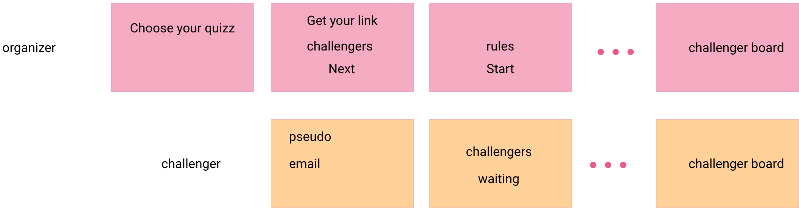

# Live Quizz - Stack Docker Complete

Stack Docker Compose complète pour l'application Live Quizz, orchestrant le frontend React, les deux APIs backend, la base de données et l'interface d'administration.

## 🏗️ Architecture

Cette stack déploie 5 services Docker interconnectés :

```
┌─────────────────────────────────────────────────────────┐
│                     Frontend React                      │
│                   (http://localhost:8080)               │
└───────────────┬─────────────────────┬───────────────────┘
                │                     │
                ▼                     ▼
    ┌──────────────────┐    ┌──────────────────┐
    │   API Quiz       │    │  API Results     │
    │ (json-server)    │    │  (Express + DB)  │
    │   Port 3000      │    │   Port 3030      │
    └──────────────────┘    └────────┬─────────┘
                                     │
                                     ▼
                            ┌─────────────────┐
                            │    MariaDB      │
                            │   Port 3306     │
                            └────────┬────────┘
                                     │
                            ┌────────▼────────┐
                            │    Adminer      │
                            │   Port 8080     │
                            └─────────────────┘
```

## 📦 Services

| Service              | Description                               | Port | Technologie             |
| -------------------- | ----------------------------------------- | ---- | ----------------------- |
| **react-live-quizz** | Interface utilisateur pour jouer aux quiz | 8080 | React 19 + Vite + Nginx |
| **api-quizz**        | API REST pour gérer les quiz et questions | 3000 | json-server             |
| **api-results**      | API REST pour stocker les résultats       | 3030 | Node.js + Express       |
| **db**               | Base de données des résultats             | 3306 | MariaDB                 |
| **adminer**          | Interface d'administration BDD            | 8080 | Adminer                 |

## 🚀 Démarrage rapide

### Prérequis

- Docker Engine 20.10+
- Docker Compose V2+
- Les 3 projets adjacents doivent être présents :
  ```
  cesi-live-quizz/
  ├── api-quizz/          # API json-server
  ├── api-results/        # API Express
  ├── react-live-quizz/   # Frontend React
  └── stack-live-quizz/   # Ce dossier (orchestration)
  ```

### Installation

1. **Copier le fichier d'environnement**

   ```bash
   cp .env.example .env
   ```

2. **Configurer les variables (optionnel)**

   Éditez le fichier `.env` si vous souhaitez modifier les ports ou configurer l'envoi d'emails :

   ```bash
   nano .env
   ```

3. **Lancer la stack complète**

   Deux options sont disponibles :

   **Option 1 : Compose standalone (recommandé pour la production)**

   ```bash
   docker compose up -d
   ```

   **Option 2 : Compose embedded (réutilise api-results/compose.yml)**

   ```bash
   docker compose -f compose.embedded.yml up -d
   ```

   > 💡 L'option embedded réutilise les définitions des services `db`, `api` et `adminer` depuis le fichier `compose.yml` du projet api-results via `extends`, évitant ainsi la duplication de code.
   >
   > **Note** : Le frontend sera accessible sur le port **8000** (au lieu de 8080) pour éviter les conflits de ports avec Adminer.

4. **Vérifier que tous les services sont lancés**

   ```bash
   docker compose ps
   ```

5. **Suivre les logs (optionnel)**
   ```bash
   docker compose logs -f
   ```

## 🌐 Accès aux services

Une fois la stack lancée, les services sont accessibles via :

- **Frontend** : http://localhost:8000
- **API Quiz** : http://localhost:3000
  - Liste des quiz : http://localhost:3000/quizz
  - Documentation : Voir [api-quizz/README.md](../api-quizz/README.md)
- **API Results** : http://localhost:3030
  - Health check : http://localhost:3030/health
  - Documentation Swagger : http://localhost:3030/api-docs
- **Adminer** (BDD) : http://localhost:8080
  - Système : `MySQL`
  - Serveur : `db`
  - Utilisateur : `apiresultsuser` (voir `.env`)
  - Mot de passe : `apiresultspwd` (voir `.env`)
  - Base : `cesi_live_quizz`

## ⚙️ Configuration

### Variables d'environnement

Toutes les variables sont définies dans le fichier `.env` avec des valeurs par défaut sensibles :

#### Ports des services

```env
API_QUIZ_PORT=3000           # Port d'accès à l'API Quiz
API_RESULTS_PORT=3030        # Port d'accès à l'API Results
REACT_APP_PORT=8000          # Port d'accès au frontend
ADMINER_PORT=8080            # Port d'accès à Adminer
```

#### Base de données

```env
DB_PORT=3306
DB_NAME=cesi_live_quizz
DB_USER=apiresultsuser
DB_PASSWORD=apiresultspwd
MYSQL_ROOT_PASSWORD=rootpassword
```

#### Configuration SMTP (optionnel)

Pour activer l'envoi automatique d'emails après chaque quiz :

```env
SMTP_ENABLED=true
SMTP_HOST=smtp.gmail.com
SMTP_PORT=587
SMTP_SECURE=false
SMTP_USER=votre-email@gmail.com
SMTP_PASS=votre-mot-de-passe-app
SMTP_FROM_NAME=Live Quizz
SMTP_FROM_EMAIL=votre-email@gmail.com
SMTP_BCC_EMAIL=admin@example.com
```

Pour Gmail, créez un [mot de passe d'application](https://myaccount.google.com/apppasswords).

#### URLs des APIs (pour le frontend)

```env
VITE_QUIZ_API_URL=http://localhost:3000
VITE_RESULTS_API_URL=http://localhost:3030
```

⚠️ **Note** : Ces URLs sont embarquées dans le build du frontend. Si vous les modifiez, vous devez reconstruire l'image :

```bash
docker compose up -d --build react-live-quizz
```

## 📋 Compose standalone vs Compose embedded

### compose.yml (Standalone)

Fichier de configuration autonome où tous les services sont définis explicitement. C'est l'approche **recommandée pour la production**.

**Avantages :**

- ✅ Configuration complète et autonome
- ✅ Pas de dépendances externes
- ✅ Facile à comprendre et à maintenir
- ✅ Commande simple : `docker compose up -d`

**Inconvénients :**

- ⚠️ Duplication de code avec `api-results/compose.yml`

### compose.embedded.yml (Embedded)

Approche modulaire qui réutilise les services définis dans `../api-results/compose.yml` via la directive `extends`.

**Comment ça fonctionne :**

- Utilise `extends` pour hériter des services `api`, `db` et `adminer` depuis `api-results/compose.yml`
- Ajoute les configurations nécessaires (networks, healthchecks, container_name)
- Définit les services locaux `api-quizz` et `react-live-quizz`

**Avantages :**

- ✅ Pas de duplication de code
- ✅ Un seul point de vérité pour db/api/adminer
- ✅ Maintien simplifié des services partagés
- ✅ **Commande simple** : `docker compose -f compose.embedded.yml up -d`

**Inconvénients :**

- ⚠️ Dépendance au fichier `api-results/compose.yml`
- ⚠️ Frontend sur le port 8000 (au lieu de 8080)
- ⚠️ Adminer expose deux ports (8080 et 8080) en raison du comportement de `extends`

**Utilisation :**

```bash
# Démarrer
docker compose -f compose.embedded.yml up -d

# Arrêter
docker compose -f compose.embedded.yml down

# Voir les logs
docker compose -f compose.embedded.yml logs -f

# Reconstruire un service
docker compose -f compose.embedded.yml up -d --build react-live-quizz
```

## 🔧 Commandes utiles

### Démarrage et arrêt

```bash
# Démarrer tous les services (standalone)
docker compose up -d

# Démarrer un service spécifique (standalone)
docker compose up -d api-quizz

# Arrêter tous les services (standalone)
docker compose down

# Arrêter et supprimer les volumes (⚠️ supprime les données de la BDD)
docker compose down -v
```

### Logs et débogage

```bash
# Voir les logs de tous les services
docker compose logs -f

# Voir les logs d'un service spécifique
docker compose logs -f api-results

# Voir le statut des services
docker compose ps

# Inspecter un service
docker compose exec api-results sh
```

### Reconstruction

```bash
# Reconstruire tous les services
docker compose build

# Reconstruire un service spécifique
docker compose build api-results

# Reconstruire et redémarrer
docker compose up -d --build
```

### Base de données

```bash
# Accéder à MariaDB en ligne de commande
docker compose exec db mysql -u apiresultsuser -p cesi_live_quizz

# Sauvegarder la base de données
docker compose exec db mysqldump -u root -prootpassword cesi_live_quizz > backup.sql

# Restaurer la base de données
docker compose exec -T db mysql -u root -prootpassword cesi_live_quizz < backup.sql
```

## 🔍 Healthchecks

Chaque service dispose d'un healthcheck pour garantir un démarrage ordonné :

- **db** : Vérifie que MariaDB est initialisé
- **api-quizz** : Vérifie que le serveur répond sur le port 80
- **api-results** : Vérifie l'endpoint `/health`
- **react-live-quizz** : Vérifie que Nginx sert le frontend

Les dépendances sont gérées automatiquement :

- `api-results` attend que `db` soit healthy
- `react-live-quizz` attend que `api-quizz` et `api-results` soient healthy

### Réinitialiser complètement la stack

```bash
# Arrêter tout
docker compose down -v

# Supprimer les images
docker compose down --rmi all

# Nettoyer Docker
docker system prune -f

# Relancer
docker compose up -d --build
```

## Technical stack


## User stories



## 📝 Références

- [Docker Compose Documentation](https://docs.docker.com/compose/)
- [API Quiz README](../api-quizz/README.md)
- [API Results README](../api-results/README.md)
- [React Live Quizz README](../react-live-quizz/README.md)

## 📄 Licence

Voir les licences individuelles de chaque projet.
